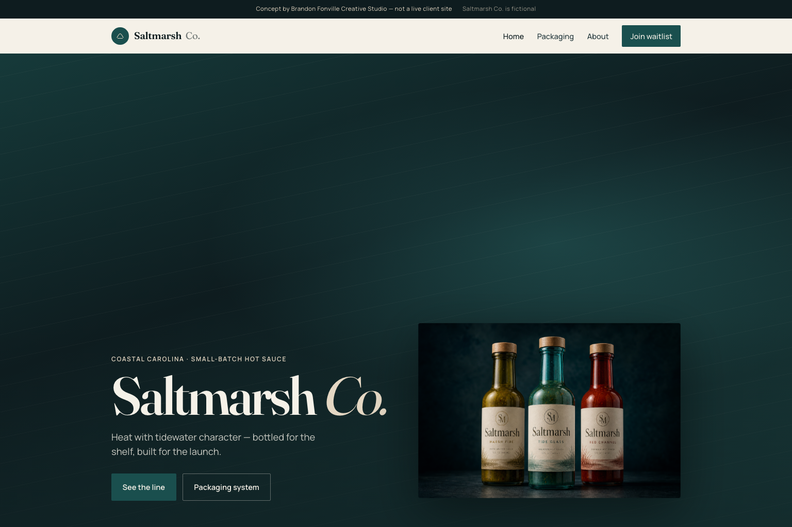

# Brandon Fonville Creative Studio

Portfolio and client site for Brandon Fonville Creative Studio.

## Overview

[brandonfonville.com](https://brandonfonville.com) is the live studio site. It covers selected work (identity, product, packaging, merch), service packages, a discovery questionnaire, and project intake. This BFCS repo is the static HTML, CSS, and JavaScript source, deployed on Netlify.

## Problem

A freelance designer’s site has to feel like a real studio and still make it simple for clients to see the work, understand packages, and start a project.

## Solution

Built a static site with a clear homepage, a works section with case studies, package based services, a discovery form, and a protected ownership area for portfolio and contracts. Netlify handles hosting and pretty URLs.

## My Role

Product Designer  
UX/UI Designer  
Frontend Developer  
Project Manager

## Process

1. Discovery
2. Research
3. Wireframes
4. Design
5. Development
6. Testing
7. Launch

## Tech Stack

HTML  
CSS  
JavaScript  
Netlify  
Google Fonts (Bebas Neue, DM Sans)

## Features

Homepage with work flipper and Start a Project CTA.  
Works portfolio with case studies including TradeVerified, ScopeSignal, Maxeimus, Blue Collar Millionaire, Knights Play, Ashford Vale, Harbor Global, and Saltmarsh.  
Saltmarsh Co. product launch concept: packaging, labels, landing page, and social sequence.  
Services packages for brand, product, digital, retainers, and web.  
Discovery questionnaire before proposals.  
Project inquiry on Write.  
About page.  
Ownership login for portfolio data and contracts.  
Theme toggle and site menu with work rail.  
Open Graph preview images.

## Screenshots




## Live Demo

Production: [https://brandonfonville.com](https://brandonfonville.com)  

Repo and Netlify source: `ogxmaxeimus/BFCS` (publish directory is `.`)

### Local preview

```bash
cd /Users/brandonfonville/Projects/BFCS
python3 -m http.server 5200
```

Open [http://127.0.0.1:5200/](http://127.0.0.1:5200/). Use a local server, not `file://`, so routes like `/works` and `/about` resolve.

## Case Study

[https://brandonfonville.com/works](https://brandonfonville.com/works)

## Status

Production. Live at [brandonfonville.com](https://brandonfonville.com).
